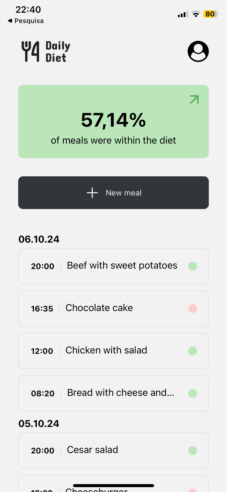
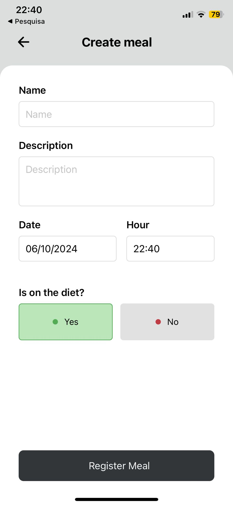
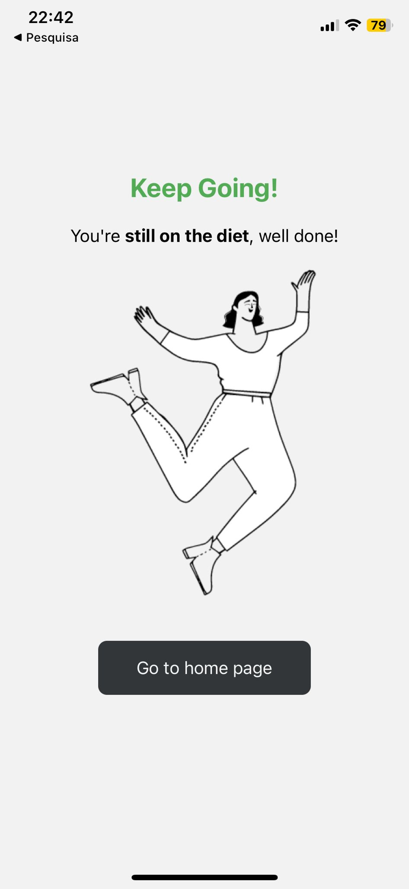
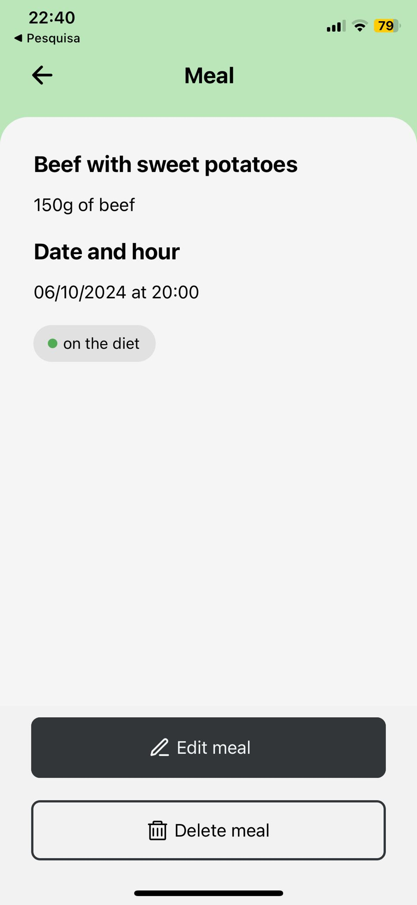
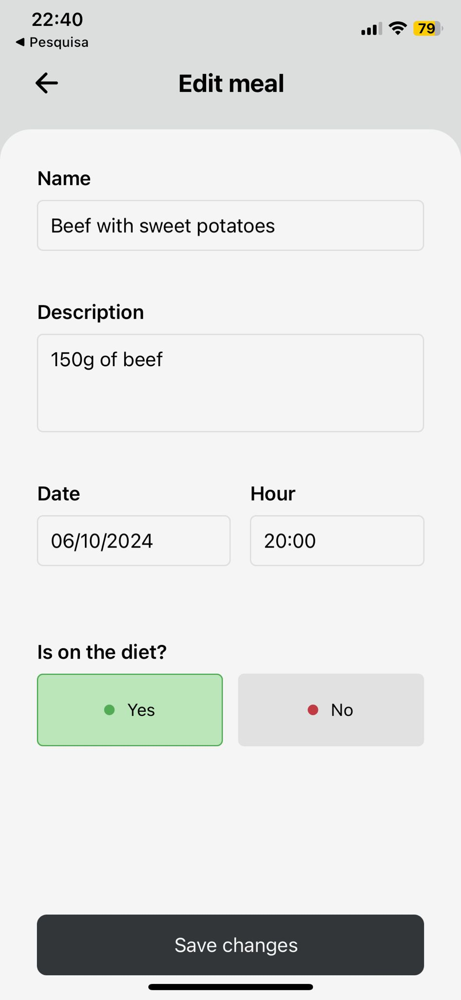
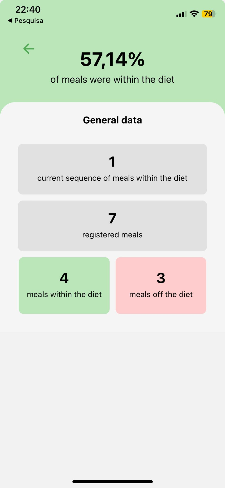

# Diet-App

A simple and functional application created with **React Native**, designed to help users control their daily meals and make it easier to monitor their diet. The application has a user-friendly interface for creating meals, editing and visualising statistical data on the user's eating habits. The application is compatible with **Android** and **iOS** devices.

## Features

- **Track Meals**: Add meals with specific details such as name, description, date, time and whether or not they are part of the diet.
- **Edit and Delete Meals**: Easily edit or remove meals from the list.
- **Meal Statistics**: View helpful statistics such as the percentage of meals that are on the diet and streaks of meals within the diet.
- **Detailed Meal View**: Click on any meal to view detailed information.
- **General Data Screen**: Overview of total meals and diet-related statistics.
- **Cross-Platform Support**: Available for both Android and iOS.

## Installation

To run this project locally, follow the instructions below:

## Prerequisites

- [Node.js](https://nodejs.org/)
- [Expo CLI](https://docs.expo.dev/get-started/installation/)
- [React Native](https://reactnative.dev/docs/environment-setup)

## Steps

1. **Clone the repository:**

```bash
git clone https://github.com/joaovff/diet-app
```

2. **Navigate to the project directory:**

```bash
cd diet-app
```

3. **Install dependencies:**

```bash
npm install
```

4. **Run the app:**

```bash
npx expo start
```

5. **Scan the QR code with the Expo Go app on your iOS or Android device, or run the app on an emulator.**

## Technologies Used

- React Native: For building the app.
- Expo: For developing and deploying the app.
- TypeScript: Ensuring type safety.
- React Navigation: For navigating between screens.
- AsyncStorage: To store data persistently on the device.
- Expo Vector Icons: Icons used throughout the app.

## Folder Structure

. ├── @types # Type definitions for meals, general data, etc. ├── assets # App assets (images, fonts, etc.) ├── components # Reusable UI components (e.g., Header, MealStats, CreateMeal) ├── constants # Theme constants (colors, font sizes) ├── navigation # Navigation setup using React Navigation ├── screens # App screens (Home, Details, CreateMeal, Edit, etc.) ├── storage # Logic to persist and retrieve meal data (AsyncStorage) ├── utils # Utility functions (e.g., date and hour formatting) ├── App.tsx # Root component of the app └── ...

## Core Functionality

### 1. **Home Screen**
   - Displays an overview of meals and their status (on diet or not).
   - Access meal statistics and track streaks of on-diet meals.
   - Add a new meal or navigate to edit an existing meal.

   

### 2. **Create Meal Screen**
   - Allows the user to add a new meal with name, time, date, and diet status.

   

### 3. **Confirmation Meal Screen**
   - Provides feedback to the user after creating the new meal based on whether or not it is on the diet.

   

### 4. **Meal Details Screen**
   - View detailed information about a specific meal.
   - Edit or delete meals from this screen.

   

### 5. **Edit Meal Screen**
   - Allows the user to edit a meal that has already been created.

   

### 6. **General Data Screen**
   - Provides a detailed summary of total meals, meals on and off diet, and diet percentages.

   

## License

All rights reserved. Any commercial use of the software is only available after mutual agreement. 